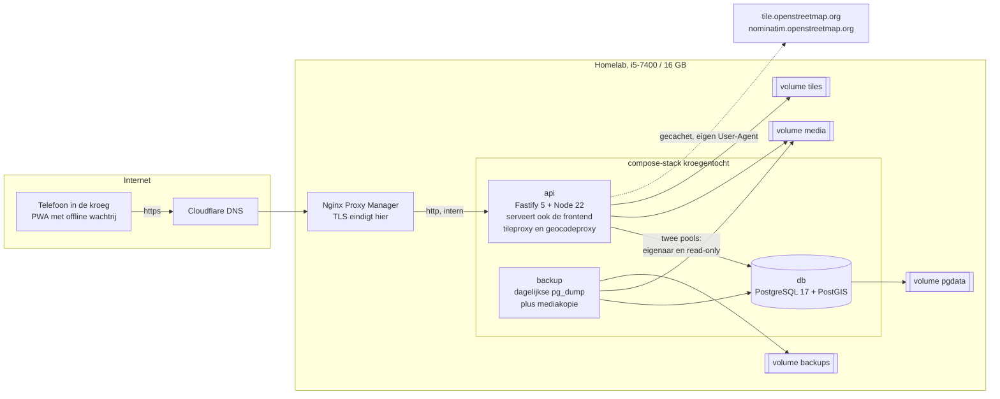

# Kroegentocht

Zelf gehoste webapplicatie om kroegentochten vast te leggen en bezochte en
anoniem gemelde tenten op een interactieve kaart te zetten. Gemaakt om op een
kleine machine achter Nginx Proxy Manager te draaien.

- Bezoek vastleggen in één formulier: foto, tent, cijfer, aanwezigen, locatie.
- Werkt offline. In een kroeg is de dekking slecht, dus alles gaat eerst naar
  IndexedDB op het toestel en daarna naar de server.
- Twee kaartlagen: je eigen tenten, en anonieme meldingen van anderen.
- Anonieme meldingen zijn ook anoniem als je de database leest.

---

## Inhoud

- [Architectuur](#architectuur)
- [Anonimiteit en privacy](#anonimiteit-en-privacy)
- [Welke persoonsgegevens waar staan](#welke-persoonsgegevens-waar-staan)
- [Bewaartermijnen](#bewaartermijnen)
- [Omgevingsvariabelen](#omgevingsvariabelen)
- [Deployen achter Nginx Proxy Manager](#deployen-achter-nginx-proxy-manager)
- [Waar de data op de host landt](#waar-de-data-op-de-host-landt)
- [Backup](#backup)
- [Herstel](#herstel)
- [Beheer](#beheer)
- [Lokaal ontwikkelen](#lokaal-ontwikkelen)
- [Tests](#tests)
- [Ontwerpkeuzes en de redenen erachter](#ontwerpkeuzes-en-de-redenen-erachter)

---

## Architectuur

Drie containers, één poort naar buiten.



**Waarom de api de frontend zelf uitserveert.** Dan hoeft er maar één container
een poort te publiceren en is er geen aparte webserver om te configureren en te
updaten. De frontend is een statische build; de api zet er de juiste
cache-headers op en stuurt onbekende paden naar `index.html` voor de
client-side routing.

**Twee databasepools.** De api verbindt twee keer met dezelfde database. De
gewone pool is de schema-eigenaar. De tweede pool logt in als `kroeg_public`,
een rol die uitsluitend `SELECT` mag doen op drie publicatieviews en op read-only
staat. Alles wat de anonieme kaartlaag uitserveert gaat via die tweede pool.
Zit er ooit een fout in een publiek endpoint, dan weigert de database de query;
er is geen pad waarlangs `visits.user_id` naar buiten kan.

**De kaart achter een abstractie.** Alle kaartlogica loopt via de interface in
`web/src/map/MapAdapter.ts`. `LeafletAdapter.ts` is het enige bestand dat
`leaflet` importeert. Een overstap naar MapLibre met vectortiles is een tweede
implementatie van die interface; geen enkel component hoeft mee te veranderen.

### Mappen

```
api/     Fastify, Drizzle, Zod. Routes, libs, migratierunner, seed.
web/     React 19, Vite, Tailwind 4, TanStack Query. PWA.
shared/  Zod-schema's, constanten en types die api en web delen.
db/      Versienummerde SQL-migraties. Deze zijn gezaghebbend voor het schema.
ops/     Dockerfiles, backupscripts, testcompose, Windows-devscript, deploydocs.
rootfs/  s6-diensten, alleen voor de Home Assistant add-on.
kroegentocht/  add-onmanifest en documentatie voor de Home Assistant add-on.
```

### Twee manieren om dit te draaien

| | Bestanden |
| --- | --- |
| **Compose-stack** op een gewone Docker-host: drie containers, database op een eigen netwerk, resourcelimieten | `compose.yaml`, `ops/api.Dockerfile`, `ops/backup/` |
| **Home Assistant add-on**: één container met Postgres en de api samen, data in `/data` zodat het in een HA-backup zit | `repository.yaml`, `kroegentocht/`, `ops/addon.Dockerfile`, `rootfs/` |

Dezelfde applicatiecode, twee verpakkingen. Let op het onderscheid tussen de twee
Dockerfiles: `ops/api.Dockerfile` is de compose-stack, `ops/addon.Dockerfile` is
de add-on.

De repo is tegelijk een **add-on repository**: je voegt hem in Home Assistant toe
via de URL, en de Supervisor haalt een kant-en-klaar image uit GHCR op in plaats
van het zelf te bouwen. Dat is nodig omdat de build-container op Home Assistant OS
geen DNS-namen kan oplossen; zie
[`ops/HOMEASSISTANT-OS.md`](ops/HOMEASSISTANT-OS.md) voor het hele verhaal.

`api/src/db/schema.ts` beschrijft hetzelfde schema in Drizzle, voor typed
queries. **De migraties zijn de bron van waarheid**: PostGIS-kolommen, generated
columns, views en rolrechten laten zich niet uit een ORM-schema genereren. Wijzig
altijd eerst de migratie.

### Wat waar gebeurt

| Onderdeel | Plek |
| --- | --- |
| Deduplicatie van tenten | `api/src/lib/venue-match.ts` plus `ST_DWithin` in `routes/venues.ts` |
| Anonimisering | `db/migrations/0004_*.sql` (views en rol) en `api/src/lib/anonymize.ts` |
| EXIF strippen en hercoderen | `api/src/lib/images.ts` |
| Offline wachtrij | `web/src/lib/offline-queue.ts` |
| Tileproxy met schijfcache | `api/src/routes/tiles.ts` |
| Migratielock | `api/src/db/migrate.ts` |

---

## Anonimiteit en privacy

Dit is vanaf de databaselaag ontworpen, niet als filter erbovenop.

**Een anonieme melding wordt alleen via een view gepubliceerd.**
`public_visit_reports` bevat precies vijf kolommen: venue, cijfer, tags, tekst en
de bezoekmaand. Geen `user_id`, geen exacte tijdstempel, geen foto's, geen
deelnemers. De maand komt uit een generated column die alleen jaar en maand
bewaart.

**Aggregaten pas vanaf drie onafhankelijke melders.** `public_venue_aggregates`
heeft `HAVING count(DISTINCT user_id) >= 3`. Drie meldingen van dezelfde persoon
tellen dus als één melder. De losse meldingsteksten hangen aan dezelfde drempel:
onder de drempel zijn ze niet op te vragen.

**De marker zelf valt ook onder de drempel.** Strenger dan alleen de aggregaten
verbergen: een tent staat pas op de anonieme kaartlaag vanaf drie melders. Bij één
melding zou de marker zelf al verraden dat daar iemand geweest is, en in een dorp
is dat één persoon.

**De read-only rol kan de bron niet lezen.** `kroeg_public` heeft geen `SELECT`
op `visits`, `users`, `visit_photos`, `visit_attendees`, `people`, `sessions`,
`friendships`, `content_reports` of `audit_log`, en staat op
`default_transaction_read_only`. De views draaien met de rechten van de eigenaar
en kunnen daardoor wel bij de brontabellen.

**Tweede controle in de applicatie.** Elke rij die naar een anonieme consument
gaat wordt in `anonymize.ts` opnieuw opgebouwd uit een witte lijst van velden. Een
kolom die iemand later aan een view toevoegt komt er niet ongemerkt door: de
functie gooit op een verboden veldnaam en filtert rijen onder de drempel weg. De
unittests dekken dit gedrag.

**EXIF gaat eruit.** Elke upload wordt met sharp hergecodeerd naar webp. Er wordt
nooit `withMetadata()` aangeroepen, dus EXIF, ICC, IPTC en XMP verdwijnen,
inclusief GPS-coördinaten. De oriëntatie wordt met `rotate()` toegepast vóórdat de
metadata weg is, anders staan telefoonfoto's op hun kant. Daarna wordt het
resultaat nog een keer gecontroleerd en gooit de upload een fout als er toch nog
metadata in zit.

**IP-adressen.** Worden alleen als rate-limit-sleutel gebruikt, en dan als
HMAC-SHA256 met het sessiegeheim plus de datum van vandaag, afgekapt op 16
hextekens. De pepper wisselt dus dagelijks. Ze staan in het geheugen van het
rate-limit-plugin en nergens anders: niet in de database, en niet in het
logboek, want de request-serializer van de logger laat `remoteAddress` weg.

**Moderatie zonder de anonimiteit op te heffen.** Een moderator ziet de gemelde
tekst en bij welke tent die hoort, en verder niets. De wachtrij haalt geen
`user_id` op, ook niet voor een admin. Verbergen zet `moderation_hidden`, waarna
de tekst uit de views verdwijnt en niet meer meetelt voor de drempel.

**Verwijderen is echt verwijderen.** Zie [Bewaartermijnen](#bewaartermijnen).

---

## Welke persoonsgegevens waar staan

| Gegeven | Waar | Toelichting |
| --- | --- | --- |
| Gebruikersnaam | `users.username` | Zelfgekozen, mag een pseudonym zijn. Geen e-mailadres, geen telefoonnummer: de applicatie vraagt er niet om en stuurt geen mail. |
| Wachtwoord | `users.password_hash` | argon2id, 64 MiB, 3 iteraties, 2 threads. Het wachtwoord zelf wordt nergens bewaard. |
| Sessie | `sessions.token_hash` | Alleen de sha256 van het token. Wie de database leest kan geen sessie overnemen. Geen IP, geen user-agent. |
| Bezoeken | `visits` | Waar je was, wanneer, wat je vond. Dit is gedrag over tijd en plaats en dus het gevoeligste in de applicatie. |
| Locatie van een bezoek | `venues.location` | Het adres van de kroeg, niet jouw positie. De GPS-meting van je telefoon wordt niet bewaard; alleen de gekozen positie van de tent. |
| Foto's | bestanden in het volume `media`, metadata in `visit_photos` | webp zonder EXIF. Bestandsnamen zijn gegenereerde uuid's; de originele bestandsnaam wordt niet bewaard. |
| Namen van maatjes | `people.name`, `visit_attendees.free_name` | Namen van derden, ingevoerd door jou. Alleen voor jou zichtbaar en niet gekoppeld aan een account. |
| Vriendschappen | `friendships` | Wie met wie, plus de status. |
| Meldingen op inhoud | `content_reports.reporter_user_id` | Wie wat meldde, voor de moderator. |
| Handelingen | `audit_log` | Wie, wat, wanneer, voor aanmaken, wijzigen en verwijderen. Bewust zonder IP-adres. |
| Anonieme meldingen | views `public_visit_reports` en `public_venue_aggregates` | Wat andere gebruikers hiervan te zien krijgen: venue, cijfer, tags, tekst, maand. |
| Gehashte IP-adressen | alleen intern geheugen | Rate limiting. Niet gepersisteerd, dagelijks wisselende pepper. |
| Kaarttegels | volume `tiles` | Geen persoonsgegevens; wel afgeleid uit wat mensen bekeken. Mag je altijd weggooien. |

Wat er **niet** in staat: e-mailadressen, telefoonnummers, betaalgegevens, ruwe
IP-adressen, GPS-sporen, en de EXIF van je foto's.

Nog steeds jouw verantwoordelijkheid: een gebruiker kan in het vrije tekstveld van
een anonieme melding natuurlijk zelf iets herleidbaars typen. Daarvoor is de
meldknop en de moderatiewachtrij.

---

## Bewaartermijnen

| Gegeven | Termijn | Wat er gebeurt |
| --- | --- | --- |
| Bezoeken, foto's, maatjes, tochten | Onbeperkt, tot de gebruiker ze verwijdert | Dit is de kern van de applicatie; automatisch opruimen zou het doel ondergraven. |
| Sessies | 30 dagen na aanmaak | Verlopen sessies worden verwijderd bij het starten van de api en daarna elke zes uur. Een wachtwoordwijziging trekt alle sessies direct in. |
| Gehashte IP-adressen | Duur van het rate-limit-venster: 1 minuut tot 1 uur | Alleen in het geheugen. Verdwijnen bij het herstarten van de container. |
| Kaarttegelcache | 30 dagen, instelbaar met `TILE_CACHE_TTL_DAYS` | Een verlopen tegel wordt bij het volgende gebruik verversd. |
| Auditlogboek | Onbeperkt | Bevat geen IP-adressen. Na het verwijderen van een account staat er `NULL` in `actor_user_id`, dus de regel blijft leesbaar zonder naar een persoon te wijzen. |
| Backups | 14 dagen, instelbaar met `BACKUP_RETENTION_DAYS` | **Let op:** een verwijderd account staat nog in de backups van de afgelopen 14 dagen. Wie een verwijderverzoek volledig wil afhandelen moet daar rekening mee houden. |
| Verwijderd account | Direct | Zie hieronder. |

### Wat "account verwijderen" precies doet

`DELETE /api/me` verwijdert onherroepelijk, in één transactie:

- de rij in `users`;
- alle `visits` van die gebruiker, dus ook de anonieme meldingen, want dat zijn
  dezelfde rijen;
- de bijbehorende `visit_photos`, `visit_attendees`, `people`, `crawls`,
  `crawl_stops`, `sessions` en `friendships`, via cascades;
- de fotobestanden op schijf, nadat de transactie geslaagd is.

Wat blijft staan:

- de `venues`, want een kroeg is geen persoonsgegeven. `created_by` wordt `NULL`;
- de regels in `audit_log`, met `actor_user_id` op `NULL`;
- de backups van de afgelopen 14 dagen.

Bijwerking die opzet is: doordat de anonieme meldingen verdwijnen, kan een tent
onder de drempel van drie melders zakken en van de publieke kaart verdwijnen.

---

## Omgevingsvariabelen

Kopieer `.env.example` naar `.env` en vul echte waarden in. De api valideert alles
bij het starten met Zod en weigert te starten als er iets ontbreekt; dat is beter
dan halverwege een request ontdekken dat een geheim leeg is.

Geheimen genereren:

```bash
openssl rand -base64 48
```

| Variabele | Verplicht | Standaard | Wat het doet |
| --- | --- | --- | --- |
| `POSTGRES_DB` | nee | `kroegentocht` | Databasenaam. |
| `POSTGRES_USER` | nee | `kroeg` | Schema-eigenaar. Moet superuser zijn, want de migraties maken extensies en een rol aan. |
| `POSTGRES_PASSWORD` | **ja** | — | Wachtwoord van de eigenaar. Vermijd `@ / : ?`, dit gaat in een URL. |
| `PUBLIC_DB_PASSWORD` | **ja** | — | Wachtwoord van de read-only rol `kroeg_public`. De migratie zet de rol met dit wachtwoord klaar. Zelfde beperking op tekens. |
| `SESSION_SECRET` | **ja** | — | Minimaal 32 tekens. Ondertekent sessiecookies en is de pepper voor gehashte IP-adressen. |
| `INVITE_CODE` | **ja** | — | Minimaal 6 tekens. Registreren zit hierachter. |
| `REGISTRATION_ENABLED` | nee | `true` | Op `false` gaat de deur dicht, ook met een geldige code. |
| `COOKIE_SECURE` | nee | `true` | Moet `true` zijn achter TLS. De api weigert te starten met `NODE_ENV=production` en `false`. |
| `PUBLIC_BASE_URL` | **ja** | — | Publieke URL. Gaat mee in de User-Agent naar OpenStreetMap. |
| `CONTACT_EMAIL` | **ja** | — | Contactadres in die User-Agent. Het gebruiksbeleid van OSM en Nominatim vraagt hierom. |
| `TRUSTED_PROXY_CIDRS` | nee | private ranges plus loopback | Alleen vanaf deze bereiken worden `X-Forwarded-*` headers vertrouwd. |
| `API_PORT` | nee | `8080` | Poort op de host. |
| `API_BIND` | nee | `127.0.0.1` | Interface op de host. Zie de deploysectie. |
| `LOG_LEVEL` | nee | `info` | `fatal` tot `trace`, of `silent`. |
| `TZ` | nee | `Europe/Amsterdam` | Tijdzone van de containers en van het backuptijdstip. |
| `TILE_CACHE_TTL_DAYS` | nee | `30` | Hoe lang een gecachete kaarttegel meegaat. |
| `TILE_UPSTREAM_TEMPLATE` | nee | `https://tile.openstreetmap.org/{z}/{x}/{y}.png` | Bron van de tegels. |
| `NOMINATIM_BASE_URL` | nee | `https://nominatim.openstreetmap.org` | Geocodingdienst. Zet dit op je eigen instantie als je die hebt. |
| `BACKUP_AT` | nee | `03:30` | Tijdstip van de dagelijkse backup, `UU:MM` in `TZ`. |
| `BACKUP_RETENTION_DAYS` | nee | `14` | Retentie van dumps en mediakopieën. |
| `BACKUP_ON_START` | nee | `true` | Meteen een backup bij het starten van de container. |
| `RATE_LIMIT_*` | nee | zie `api/src/config/env.ts` | Limieten voor inloggen, registreren, uploaden, geocoden en het geheel. |
| `SEED_PASSWORD` | nee | een vaste demowaarde | Alleen voor het seed-script. Laat weg op een server die in gebruik is. |

Het schema met alle standaardwaarden staat in
[`api/src/config/env.ts`](api/src/config/env.ts).

---

## Deployen achter Nginx Proxy Manager

De applicatie luistert zelf alleen op plain HTTP. TLS eindigt bij de proxy.

> Draait je server **Home Assistant OS**? Volg dan
> [`ops/HOMEASSISTANT-OS.md`](ops/HOMEASSISTANT-OS.md) in plaats van de stappen
> hieronder. Daar is `docker compose` niet beschikbaar en beheert de Supervisor
> deze containers niet, dus de aanpak en de risico's zijn anders.

### 1. Repo en configuratie

```bash
git clone <deze-repo> /opt/kroegentocht
cd /opt/kroegentocht
cp .env.example .env
$EDITOR .env
```

Vul minimaal `POSTGRES_PASSWORD`, `PUBLIC_DB_PASSWORD`, `SESSION_SECRET`,
`INVITE_CODE`, `PUBLIC_BASE_URL` en `CONTACT_EMAIL`.

### 2. Starten

```bash
docker compose up -d --build
docker compose logs -f api
```

De api voert de migraties zelf uit bij het starten, achter een advisory lock, dus
twee containers die tegelijk opkomen botsen niet. In de logs staat welke migraties
zijn toegepast en dat `kroeg_public` read-only is gezet.

Controleer:

```bash
curl -fsS http://127.0.0.1:8080/healthz   # liveness, raakt de database niet aan
curl -fsS http://127.0.0.1:8080/readyz    # raakt beide pools aan
```

`readyz` moet `{"status":"ok","checks":{"database":"ok","publicView":"ok"}}`
geven. Staat `publicView` op `fout`, dan klopt `PUBLIC_DB_PASSWORD` niet.

### 3. DNS bij Cloudflare

Maak een A- of AAAA-record naar het publieke IP van de machine, of een CNAME naar
je bestaande hostnaam. Zet de proxystatus op **DNS only** (grijze wolk) als je de
kaarttegelproxy niet door Cloudflare wilt laten cachen; met de oranje wolk werkt
het ook, maar dan cachet Cloudflare je tegels een tweede keer.

### 4. Proxy host in Nginx Proxy Manager

Er zijn twee varianten. Kies er één.

**Variant A: NPM draait op de host, of kan bij `127.0.0.1` van de host.**

Dit is de standaard. De api publiceert `127.0.0.1:8080`.

- Domain Names: `kroegen.voorbeeld.nl`
- Scheme: `http`
- Forward Hostname / IP: `127.0.0.1`
- Forward Port: `8080`
- Websockets Support: aan (niet nodig nu, wel als er later live updates komen)
- Block Common Exploits: aan
- SSL tab: nieuw Let's Encrypt-certificaat, **Force SSL** aan,
  **HTTP/2** aan, **HSTS** aan

**Variant B: NPM draait zelf in Docker, in een eigen stack.**

Dan hoeft er helemaal geen poort op de host open.

```bash
docker network create proxy
```

Hang NPM aan datzelfde netwerk (in zijn eigen compose-bestand):

```yaml
networks:
  proxy:
    external: true
```

Start deze stack met de override erbij:

```bash
docker compose -f compose.yaml -f compose.npm-network.yaml up -d --build
```

In NPM:

- Forward Hostname / IP: `kroegentocht-api`
- Forward Port: `3000`

### 5. Advanced-tab in NPM

De api zet zelf al HSTS en een strikte Content Security Policy. Voeg alleen de
uploadlimiet toe, anders weigert nginx een foto van 10 MB voordat de api hem ziet:

```nginx
client_max_body_size 12m;
```

Zet in de Advanced-tab **geen** eigen `add_header Content-Security-Policy` regel:
dan staan er twee policies en geldt de striktste combinatie, wat in de praktijk
betekent dat er iets stilletjes niet meer werkt.

### 6. Eerste account

Ga naar `https://kroegen.voorbeeld.nl/registreren`, vul de `INVITE_CODE` in en maak
je account. Maak jezelf daarna admin:

```bash
docker compose exec db psql -U kroeg -d kroegentocht \
  -c "UPDATE users SET role = 'admin' WHERE username = 'jouwnaam';"
```

Zet daarna eventueel `REGISTRATION_ENABLED=false` en herstart de api.

---

## Waar de data op de host landt

Vier named volumes. Bij een standaard Docker-installatie staan die onder
`/var/lib/docker/volumes/`:

| Volume | Pad op de host | Inhoud |
| --- | --- | --- |
| `kroegentocht_pgdata` | `/var/lib/docker/volumes/kroegentocht_pgdata/_data` | De database. |
| `kroegentocht_media` | `/var/lib/docker/volumes/kroegentocht_media/_data` | De fotobestanden, webp zonder metadata, gesorteerd per jaar en maand. |
| `kroegentocht_tiles` | `/var/lib/docker/volumes/kroegentocht_tiles/_data` | Kaarttegelcache. Mag je altijd weggooien; hij loopt weer vol. |
| `kroegentocht_backups` | `/var/lib/docker/volumes/kroegentocht_backups/_data` | Dagelijkse dumps en mediakopieën. |

Wil je ze op een andere schijf, vervang dan de volumedefinitie door een bind
mount, bijvoorbeeld:

```yaml
volumes:
  pgdata:
    driver: local
    driver_opts:
      type: none
      o: bind
      device: /mnt/data/kroegentocht/pgdata
```

De mediamap staat expliciet **niet** in de webroot. Foto's gaan alleen via
`GET /api/photos/:id`, dat eerst opzoekt bij welk bezoek de foto hoort en dan of
de kijker dat bezoek mag zien. Er is dus geen directory listing en geen
raadbare URL.

---

## Backup

De `backup`-container maakt elke dag om `BACKUP_AT` (standaard 03:30, in `TZ`):

- `db-JJJJMMDD-UUMMSS.dump` — `pg_dump --format=custom --compress=6`, dus
  gecomprimeerd en selectief terug te zetten met `pg_restore`;
- `media-JJJJMMDD-UUMMSS.tar.gz` — de hele mediamap.

Beide worden eerst als `.partial` geschreven en pas daarna op hun definitieve
naam gezet, zodat een afgebroken backup er niet als geldige backup bij ligt.
Bestanden ouder dan `BACKUP_RETENTION_DAYS` worden opgeruimd, en alleen als ze aan
het naampatroon voldoen: een kopie die je er zelf bij zette blijft staan.

Er zit geen cron in de container. Een lus die uitrekent hoeveel seconden het nog
is tot het volgende tijdstip is even betrouwbaar en volledig te volgen in
`docker compose logs backup`.

Controleren:

```bash
docker compose logs backup | tail -20
docker compose exec backup ls -lh /backups
```

Handmatig een backup maken, bijvoorbeeld voor een update:

```bash
docker compose exec backup /usr/local/bin/backup.sh
```

Naar buiten kopiëren, want een backup op dezelfde machine is geen backup:

```bash
docker compose cp backup:/backups ./backups-export
# of, netter, met een tweede opslag:
rsync -av /var/lib/docker/volumes/kroegentocht_backups/_data/ nas:/backups/kroegentocht/
```

---

## Herstel

Deze procedure is uit te voeren en te testen zonder de productiedata aan te
raken; doe dat ook, minstens één keer. Een backup die je nooit hebt teruggezet is
een aanname.

### Controleren wat er in een dump zit

```bash
docker compose exec backup /usr/local/bin/restore.sh check /backups/db-20260826-033000.dump
```

### Database terugzetten

```bash
# 1. De api eruit, zodat er niets schrijft tijdens het terugzetten.
docker compose stop api

# 2. Terugzetten. Het script vraagt om een bevestiging; FORCE=1 slaat die over.
docker compose exec backup \
  /usr/local/bin/restore.sh db /backups/db-20260826-033000.dump

# 3. Api weer aan. Die voert de migraties opnieuw uit en zet de rol
#    kroeg_public met zijn rechten terug.
docker compose start api

# 4. Controleren.
curl -fsS http://127.0.0.1:8080/readyz
```

`pg_restore` geeft waarschuwingen over objecten die hij niet kon verwijderen
omdat ze niet bestonden. Dat is normaal bij `--clean --if-exists`.

### Media terugzetten

De mediamap is read-only in de backupcontainer gemount, dus dit gaat via een
losse container:

```bash
docker compose stop api

docker run --rm \
  -v kroegentocht_media:/restore \
  -v kroegentocht_backups:/backups:ro \
  alpine sh -c 'rm -rf /restore/* && tar -xzf /backups/media-20260826-033000.tar.gz -C /restore'

docker compose start api
```

### Herstel testen zonder risico

Zet de backup terug in een wegwerpstack:

```bash
# Losse database op poort 55433
docker run -d --name kt-restore-test \
  -e POSTGRES_DB=kroegentocht -e POSTGRES_USER=kroeg -e POSTGRES_PASSWORD=test \
  -p 127.0.0.1:55433:5432 postgis/postgis:17-3.5

# Even wachten tot hij klaar is, dan de dump erin
docker run --rm --network host \
  -v kroegentocht_backups:/backups:ro \
  -e PGPASSWORD=test \
  postgres:17-alpine \
  pg_restore -h 127.0.0.1 -p 55433 -U kroeg -d kroegentocht \
    --clean --if-exists --no-owner --no-privileges /backups/db-20260826-033000.dump

# Tellen of het klopt
docker exec kt-restore-test psql -U kroeg -d kroegentocht \
  -c "SELECT (SELECT count(*) FROM users) AS gebruikers,
             (SELECT count(*) FROM visits) AS bezoeken,
             (SELECT count(*) FROM venues) AS tenten;"

docker rm -f kt-restore-test
```

### Volledig opnieuw opbouwen na verlies van de machine

1. Docker en Docker Compose installeren.
2. Repo clonen en `.env` terugzetten. **`.env` staat niet in de backups**; bewaar
   die apart, bijvoorbeeld in een wachtwoordmanager. Zonder `SESSION_SECRET`
   werken bestaande sessiecookies niet meer (iedereen moet opnieuw inloggen), en
   zonder de databasewachtwoorden kom je niet bij een teruggezette dump.
3. Backupbestanden in het volume `kroegentocht_backups` zetten.
4. `docker compose up -d --build`, wachten tot de migraties klaar zijn.
5. Database en media terugzetten volgens de stappen hierboven.
6. `curl /readyz` en inloggen.

---

## Beheer

```bash
# Logs
docker compose logs -f api
docker compose logs -f backup

# Bijwerken na een git pull
docker compose up -d --build

# Psql-prompt
docker compose exec db psql -U kroeg -d kroegentocht

# Iemand moderator maken
docker compose exec db psql -U kroeg -d kroegentocht \
  -c "UPDATE users SET role = 'moderator' WHERE username = 'naam';"

# Kaarttegelcache leeggooien
docker compose exec api sh -c 'rm -rf /var/lib/kroegentocht/tiles/*'

# Testdata in een lege database (niet op een server die in gebruik is)
docker compose exec api node api/dist/db/seed.js
```

Het seed-script doet niets als er al gebruikers zijn, tenzij je `SEED_FORCE=1`
meegeeft; dat wist eerst alles. De set testdata bevat opzettelijk een tent met
drie melders (zichtbaar op de anonieme laag), een tent met twee melders
(onzichtbaar), twee tenten binnen 30 meter met een vergelijkbare naam voor de
deduplicatie, en een tocht met vier stops.

---

## Lokaal ontwikkelen

```bash
npm install
npm run build -w shared      # api en web importeren de gebouwde versie
docker compose -f ops/compose.test.yaml up -d   # database op poort 55432
```

Zet een `.env` klaar of exporteer de variabelen, en dan:

```bash
npm run migrate     # migraties op de dev-database
npm run seed        # testdata
npm run dev:api     # Fastify op :3000
npm run dev:web     # Vite op :5173, proxyt /api en /tiles naar :3000
```

Voor de dev-server geldt `COOKIE_SECURE=false`, want er is geen https.

### Op deze Windows-machine

De repo staat op `C:\dev\kroegentocht`, bewust buiten OneDrive. Er is één ding dat
nog geregeld moet worden: Node staat niet op `PATH`, er is een portable Node 22 in
`%LOCALAPPDATA%\node-portable`. Daarvoor is `ops/win-dev.ps1`:

```powershell
. .\ops\win-dev.ps1
```

Verder werkt alles gewoon. De repo bevat geen enkele aanpassing voor deze machine:
`.npmrc` en de tsconfigs zijn schoon, zodat de Docker-build en CI niet meelijden.

#### Zet de repo niet terug in OneDrive

Dit project stond eerst onder `OneDrive - IG&H\Documents`. Twee redenen om dat
niet opnieuw te doen, mocht de gedachte opkomen:

- **De ampersand in `IG&H`.** npm start zijn lifecycle-scripts via `cmd.exe`, en
  cmd knipt `PATH` af op die ampersand. Elk npm-script faalt dan met *"is not
  recognized as an internal or external command"*. Werkbaar met
  `$env:npm_config_script_shell = (Get-Command pwsh).Source`, en dan pwsh en niet
  `powershell.exe`, want Windows PowerShell 5.1 kent de operator `&&` niet en die
  staat in de buildscripts.
- **OneDrive dat 180 MB `node_modules` synchroniseert.** Vervang `node_modules`
  dan niet door een directory junction om dat te omzeilen. npm zet in een
  workspace-repo symlinks in `node_modules` die terugwijzen naar de
  workspacemappen zelf (`node_modules/@kroegentocht/api` → `../../api`). Een
  `Move-Item` of `robocopy /MOVE` over die boom volgt die symlinks en verhuist je
  broncode mee de junction in. Dat is bij het opzetten van dit project een keer
  gebeurd; alles was terug te halen, maar het kostte een half uur.

---

## Tests

```bash
npm run test:unit          # geen database nodig
npm run testdb:up          # PostGIS op 127.0.0.1:55432
npm run test:integration
npm run testdb:down
```

**Unittests** (`api/tests/unit/`) dekken de twee stukken logica waar het echt op
aankomt:

- `anonymize.test.ts` — de veldwitlijst, de k-drempel op precies drie melders, het
  terugbrengen van een datum tot een maand, en dat een rij met een meegeglipt
  `user_id` een fout geeft in plaats van stil door te gaan.
- `venue-match.test.ts` — normalisatie van tentnamen, trigram-similariteit, en de
  matchbeslissing inclusief de grensgevallen op 49, 50 en 51 meter, een andere
  tent op hetzelfde adres, en een gelijk `osm_id` dat de radius overstemt.

**Integratietests** (`api/tests/integration/api.test.ts`) draaien tegen een echte
PostGIS en dekken registreren met uitnodigingscode, Zod-validatie op body én
querystring, deduplicatie van tenten, idempotentie van de offline wachtrij,
uploads (inclusief een zip die zich voordoet als jpeg, en de controle dat de EXIF
er echt uit is), autorisatie op het fotoendpoint, de k-anonimiteitsdrempel in drie
stappen, het feit dat `kroeg_public` de tabel `visits` niet kan lezen, moderatie,
bounding-box-queries, tochtafstanden, export en het volledig verwijderen van een
account.

Zonder database wordt die suite overgeslagen in plaats van rood te worden, zodat
`npm test` ook werkt op een machine zonder Docker.

De CI in `.github/workflows/ci.yml` doet dit alles plus `npm audit
--audit-level=high --omit=dev`, wat de build breekt bij een bekende
kwetsbaarheid in een productieafhankelijkheid. Devdependencies worden ook
gecontroleerd, maar informatief: een kwetsbaarheid in een buildtool komt niet in
het image terecht. De workflow draait ook wekelijks op een schema, zodat een
nieuw gepubliceerde kwetsbaarheid ook zonder commit wordt opgemerkt. De laatste
stap controleert dat het api-image als `node` draait en niet als root.

---

## Ontwerpkeuzes en de redenen erachter

**Alles gaat eerst naar IndexedDB.** Er is geen aparte online- en offlineroute
voor het opslaan van een bezoek. Opslaan schrijft naar de wachtrij en versturen is
een tweede, herhaalbare stap. Eén code-pad, en een slechte verbinding kan geen
avond wissen. De server maakt herhaald versturen veilig met een
`idempotencyKey`.

**Geen Background Sync API.** Die bestaat alleen in Chromium, dus op iOS niet. De
wachtrij wordt door de app zelf leeggemaakt bij het online komen en elke minuut.
De service worker doet alleen wat hij overal goed doet: de app en de kaarttegels
cachen.

**Eigen tileproxy.** Het gebruiksbeleid van OpenStreetMap verwacht dat je hun
tegels cachet in plaats van bij elke pan opnieuw op te halen. Bijkomend voordeel:
de browser praat alleen met onze eigen origin, dus `connect-src` en `img-src`
kunnen op `'self'` blijven staan en er lekt geen referrer of IP-adres van een
gebruiker naar een derde partij. Nominatim loopt om dezelfde redenen via de
server, met een limiet van één verzoek per seconde en een identificeerbare
User-Agent. Er wordt niet vooruit gecachet en niet in bulk gedownload.

**Deduplicatie deels in SQL, deels in TypeScript.** PostGIS doet het ruimtelijke
voorwerk met `ST_DWithin` op de GIST-index. De beslissing valt daarna in
TypeScript, op genormaliseerde namen en een eigen implementatie van
trigram-similariteit met dezelfde definitie als `pg_trgm`. Daardoor is de hele
beslisregel te testen zonder database. Het aanmaken loopt in een transactie met
een advisory lock op het rastervak van de coördinaten, zodat twee mensen die op
hetzelfde moment dezelfde kroeg vastleggen geen twee tenten maken. Er is een
unieke index als laatste vangnet.

**Afstanden zijn hemelsbreed.** `ST_Distance` op `geography`, dus geodetisch maar
niet de route die je liep. Een echte looproute zou een routeringsdienst vragen en
die hoort niet in een kroegapp. De UI zegt dat er ook bij.

**Heatmap zonder plugin.** `leaflet.heat` is klein maar niet onderhouden, en de
laag hoeft alleen dichtheid te tonen. Dat lukt met cirkels op een
canvas-renderer, met radius en dekking naar gewicht. Eén afhankelijkheid minder
om in de gaten te houden, en dat is ook een securityeis.

**Base image is `node:22-slim`, niet alpine.** `sharp` en `@node-rs/argon2`
hebben voorgebouwde binaries voor glibc. Op musl moeten die gecompileerd worden,
wat de build minuten kost en op een i5 niet grappig meer is. Slim is ongeveer
80 MB basis en dat is klein genoeg.

**Eén uitzondering in de CSP.** `script-src` staat op `'self'` zonder nonces of
hashes; de Vite-build produceert alleen externe modulebestanden en de service
worker wordt vanuit `main.tsx` geregistreerd in plaats van met een inline
scriptje. `style-src-attr` staat wel op `'unsafe-inline'`, want Leaflet
positioneert tegels en markers met stijlattributen. Inline stylesheets en inline
scripts blijven verboden, dus het aanvalsoppervlak dat bij script-injectie hoort
verandert daar niet door.

**Statuscodes verklappen niets.** Een bezoek of foto van iemand anders geeft 404
en niet 403. Anders is uit de statuscode af te leiden wat er bestaat.

**Sessies serverside.** Een ondoorzichtig token van 32 random bytes in een
httpOnly-cookie, waarvan alleen de sha256 in de database staat. Daarmee kan een
sessie direct worden ingetrokken, wat met een JWT niet lukt, en verdwijnen alle
sessies mee bij het verwijderen van een account.
